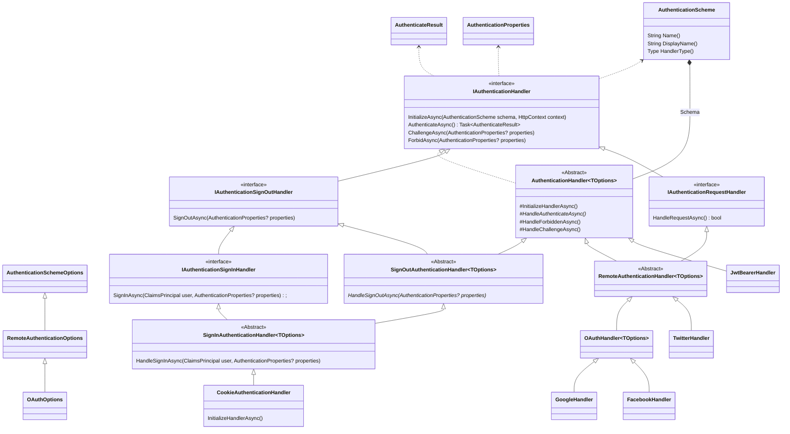

```mermaid
classDiagram
    direction BT

    class AuthenticationScheme {
        String Name()
        String DisplayName()
        Type HandlerType()
    }

    class AuthenticationProperties {

    }

    class AuthenticationSchemeOptions

    class AuthenticateResult

    %% Created per request to handle authentication for a particular scheme
    class IAuthenticationHandler {
        <<interface>>
        InitializeAsync(AuthenticationScheme schema, HttpContext context)
        AuthenticateAsync() Task~AuthenticateResult~
        ChallengeAsync(AuthenticationProperties? properties)
        ForbidAsync(AuthenticationProperties? properties)
    }
    IAuthenticationHandler ..> AuthenticateResult
    IAuthenticationHandler ..> AuthenticationProperties
    IAuthenticationHandler ..> AuthenticationScheme
   
    class AuthenticationHandler~TOptions~ {
        <<Abstract>>
        #InitializeHandlerAsync()
        #HandleAuthenticateAsync()*
        #HandleForbiddenAsync()
        #HandleChallengeAsync()
    }
    AuthenticationHandler~TOptions~ ..|> IAuthenticationHandler
    AuthenticationHandler~TOptions~ --* AuthenticationScheme: Schema

    %% Used to determine if a handler supports SignOut.
    class IAuthenticationSignOutHandler {
        <<interface>>
        SignOutAsync(AuthenticationProperties? properties)
    }
    IAuthenticationSignOutHandler --|> IAuthenticationHandler

    %% Used to determine if a handler supports SignIn.
    class IAuthenticationSignInHandler {
        <<interface>>
        SignInAsync(ClaimsPrincipal user, AuthenticationProperties? properties);
    }
    IAuthenticationSignInHandler --|> IAuthenticationSignOutHandler

    class SignOutAuthenticationHandler~TOptions~ {
        <<Abstract>>
        HandleSignOutAsync(AuthenticationProperties? properties)*
    }
    SignOutAuthenticationHandler~TOptions~ --|> AuthenticationHandler~TOptions~
    SignOutAuthenticationHandler~TOptions~ --|> IAuthenticationSignOutHandler

    class SignInAuthenticationHandler~TOptions~ {
        <<Abstract>>
        HandleSignInAsync(ClaimsPrincipal user, AuthenticationProperties? properties)
    }
    SignInAuthenticationHandler~TOptions~ --|> SignOutAuthenticationHandler~TOptions~
    SignInAuthenticationHandler~TOptions~ --|> IAuthenticationSignInHandler

    class CookieAuthenticationHandler {
        InitializeHandlerAsync()
    }
    CookieAuthenticationHandler --|> SignInAuthenticationHandler~CookieAuthenticationOptions~

    class IAuthenticationRequestHandler {
        <<interface>>
        HandleRequestAsync() bool
    }
    IAuthenticationRequestHandler --|>IAuthenticationHandler

    class RemoteAuthenticationOptions
    RemoteAuthenticationOptions --|> AuthenticationSchemeOptions

    class RemoteAuthenticationHandler~TOptions~ {
        <<Abstract>>
    }
    RemoteAuthenticationHandler~TOptions~ --|> AuthenticationHandler~TOptions~
    RemoteAuthenticationHandler~TOptions~ --|> IAuthenticationRequestHandler

    class OAuthOptions
    OAuthOptions --|> RemoteAuthenticationOptions

    class OAuthHandler~TOptions~
    OAuthHandler~TOptions~ --|> RemoteAuthenticationHandler~TOptions~

    class GoogleHandler
    GoogleHandler --|> OAuthHandler~GoogleOptions~

    class FacebookHandler
    FacebookHandler --|> OAuthHandler~FacebookOptions~

    class TwitterHandler
    TwitterHandler --|> RemoteAuthenticationHandler~TwitterOptions~

    class JwtBearerHandler
    JwtBearerHandler --|> AuthenticationHandler~JwtBearerOptions~

```

- `AuthenticationProperties` Dictionary used to store state values about the authentication session.